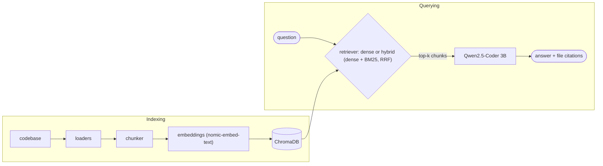
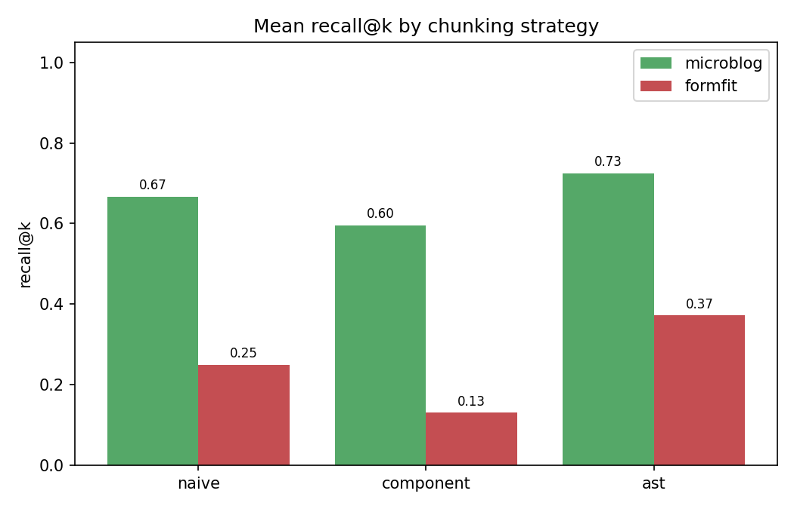

# codebase-qa-rag

A fully **local, privacy-preserving** Retrieval-Augmented Generation (RAG) system that
answers natural-language questions about a codebase — *"How does authentication work in
this project?"* — and cites the exact source files it used. Every model runs on your own
machine through [Ollama](https://ollama.com); **no source code ever leaves the device**.

> This is the engineering artefact of a SEE University Capstone thesis:
> **A Local AI Assistant for Codebase Question-Answering: Comparing Retrieval Strategies
> for Angular and Python Projects** — Arb Xhelili, mentor Shqipe Salii, 2026.

## Features

- 🔒 **100% local** — generation, embeddings and grading all run through Ollama; nothing is uploaded.
- 🧩 **Three swappable chunking strategies** — naive windows, component/module grouping, and AST-aware (tree-sitter).
- 🔎 **Dense and hybrid retrieval** — vector search, plus hybrid dense + BM25 fused with reciprocal rank fusion.
- 📚 **Grounded answers with citations** — every answer points back to the source files it used.
- 📊 **Reproducible evaluation** — a hand-labelled benchmark, retrieval metrics, and a local LLM judge.
- 🌐 **Web UI + CLI** — a FastAPI backend with a small front end, and a one-line command-line interface.

## What it studies

Which **code-chunking strategy** gives the best retrieval and answer quality for codebase
Q&A on consumer hardware? The system makes three axes swappable and measures every
combination:

| Axis | Options |
|------|---------|
| **Chunking** | `naive` (fixed token windows) · `component` (Angular component file-groups / Python modules) · `ast` (tree-sitter functions & classes) |
| **Retrieval** | `dense` (vector embeddings) · `hybrid` (dense + BM25, reciprocal-rank fusion) |
| **Codebase** | FormFit (Angular / TypeScript) · Microblog (Flask / Python) |

Answers are generated by **Qwen2.5-Coder 3B**; retrieval is scored with precision/recall/MRR
against hand-labelled gold files; and answer quality is graded by a **Llama-3.1-8B** judge
that is itself validated against manual grading.

## How it works



## Requirements

- **Python 3.11+**
- **[Ollama](https://ollama.com)** running locally
- Ollama models (~7 GB total):
  - `qwen2.5-coder:3b` and `nomic-embed-text` — needed to ask questions
  - `llama3.1:8b` — only needed to *reproduce the experiments* (the LLM judge)
- A GPU helps but is optional; everything runs on CPU, just slower.

## Installation

```bash
git clone https://github.com/Mistik03/codebase-qa-rag.git
cd codebase-qa-rag
python -m pip install -r requirements.txt

ollama pull qwen2.5-coder:3b
ollama pull nomic-embed-text
ollama pull llama3.1:8b          # only for reproducing the experiments
```

Codebases under test are configured in [`config.yaml`](config.yaml). **Microblog** is the
public, runnable example — clone it into `external/`:

```bash
git clone https://github.com/miguelgrinberg/microblog external/microblog
```

> FormFit is the author's private Angular project, referenced by a local path in
> `config.yaml`; point that entry at any Angular project of your own to reproduce the
> Angular side.

## Usage

**Ask a question (CLI).** The first run builds the index; add `--reindex` to rebuild it.

```bash
python -m experiments.ask --codebase microblog --strategy ast --method hybrid \
    "How does user authentication work?"
```

`--strategy` is `naive` | `component` | `ast`; `--method` is `dense` | `hybrid`.

**Run the web app.** Start the API, then open <http://localhost:8000>.

```bash
uvicorn api.main:app --reload
```

**Reproduce the experiments.** Runs the full grid, then writes tables and figures to
`experiments/results/`.

```bash
python -m experiments.run_grid     # all chunking × retrieval × codebase combinations
python -m experiments.analyze      # aggregate into summary tables + figures
python eval/validate_judge.py      # LLM-judge vs. manual-grading agreement
```

## Results

Averaged across both codebases over a 40-question benchmark (20 per project; full numbers in
[`experiments/results/summary.md`](experiments/results/summary.md), significance tests in
[`stats.md`](experiments/results/stats.md)):

| Chunking | Recall@k | MRR | Judge (1–5) |
|----------|:--------:|:---:|:-----------:|
| naive | 0.53 | 0.64 | 3.70 |
| component | 0.49 | 0.66 | 3.64 |
| **ast** | **0.65** | **0.74** | **3.77** |



- **AST-aware chunking wins** on both codebases; its recall gain over the other two strategies is **statistically significant** (paired t-test, p < 0.001).
- **Hybrid retrieval** beats dense on ranking and recall, significantly improving MRR (0.75 vs 0.61).
- **Component grouping underperformed** — a useful negative result: bundling several files into one chunk dilutes its embedding and hurts retrieval.
- **Judge reliability:** on a manually re-graded subset the LLM judge agreed exactly 67% of the time and within one point 100% of the time (mildly lenient).
- Evaluated on one Angular and one Python project, so these are **case studies**, not general claims about either ecosystem.

## Project layout

| Path | Contents |
|------|----------|
| `src/coderag/` | Library: loaders, chunking strategies, embeddings, vector store, retrieval, generation, judge, metrics |
| `api/` | FastAPI backend (`POST /query`) |
| `web/` | Minimal Angular front end |
| `benchmark/` | Hand-labelled QA datasets (`*.jsonl`) |
| `experiments/` | Grid runner, analysis, and results (CSV + figures) |
| `eval/` | LLM-judge validation against manual grades |
| `config.yaml` | Models, retrieval depth, chunk sizes, and codebase locations |

## License

[MIT](LICENSE) © 2026 Arb Xhelili
